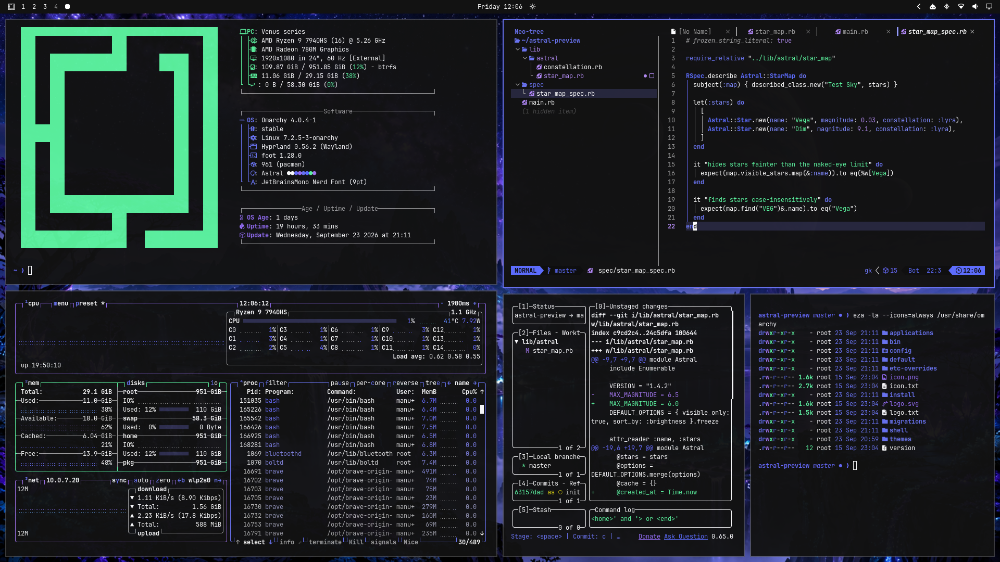
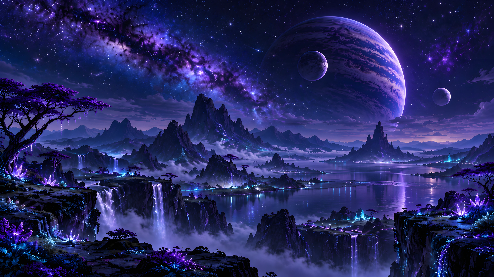
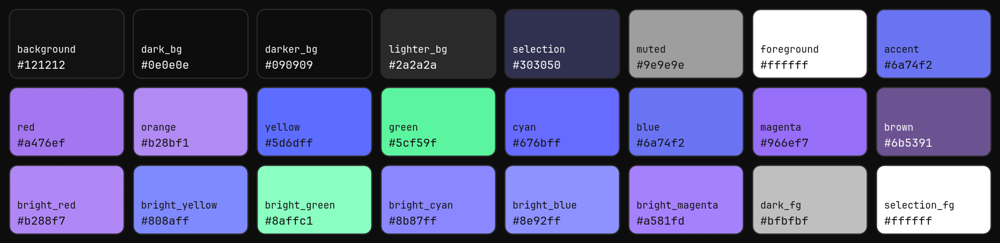

# Astral

A dark [Omarchy](https://omarchy.org) theme inspired by a night sky over a mystical world: deep indigo and violet on near-black, with a single neon-green glow for strings in your code.



## Install

```bash
omarchy theme install https://github.com/brmnl/omarchy-astral-theme
```

Omarchy installs it as `astral`, and you can switch to it at any time with:

```bash
omarchy theme set astral
```

## Wallpaper



A night sky over a mystical world: a glowing violet nebula, a banded gas giant with two moons, misty mountain spires, waterfalls and glowing crystals. Included in 4K (3840×2160).

## Palette



The theme is built on a neutral near-black base. The indigo and violet shades carry the mood, and neon green is the one glowing accent, so it stands out wherever it shows up.

### Base

| Role | Color | Used for |
| --- | --- | --- |
| `background` | `#121212` | Terminal and editor background |
| `dark_background` | `#0e0e0e` | Sidebars, panels |
| `darker_background` | `#090909` | Deepest surfaces |
| `lighter_background` | `#2a2a2a` | Popups, status lines |
| `selection` | `#303050` | Selected text (indigo tint, so selections show up) |
| `foreground` | `#ffffff` | Main text |
| `muted` | `#9e9e9e` | Comments, line numbers, inactive elements |
| `accent` | `#6a74f2` | Window borders, bar highlights, focus |

### Colors

| Name | Normal | Bright |
| --- | --- | --- |
| `red` | `#a476ef` | `#b288f7` |
| `orange` | `#b28bf1` | |
| `yellow` | `#5d6dff` | `#808aff` |
| `green` | `#5cf59f` | `#8affc1` |
| `cyan` | `#676bff` | `#8b87ff` |
| `blue` | `#6a74f2` | `#8e92ff` |
| `magenta` | `#966ef7` | `#a581fd` |
| `brown` | `#6b5391` | |

Even the "warm" colors (red, orange, yellow) are shades of violet and periwinkle, which keeps the whole desktop in the same cool family.

## Code highlighting

Omarchy generates the Neovim colorscheme from `colors.toml`, so code looks like this:

| Syntax | Color |
| --- | --- |
| Strings | neon green `#5cf59f` |
| Keywords | violet `#a581fd` |
| Functions | indigo `#6a74f2`, bold |
| Types | periwinkle `#5d6dff`, bold |
| Numbers, booleans | lavender `#b28bf1` |
| Constants | `#808aff` |
| Parameters, properties | `#676bff` / `#8b87ff` |
| Comments | grey `#9e9e9e` |

In git diffs, added lines show in green and removed lines in violet.

### Optional: indigo current line in Neovim

By default, Neovim highlights the current line (and the file under the cursor in the explorer) in grey. Omarchy doesn't let a theme installed from git run Lua code, so Astral can't change this for you. If you want the current line tinted indigo like the rest of the theme, add it yourself.

Create the file `~/.config/nvim/lua/plugins/astral.lua` with this content:

```lua
-- Astral: tint the current line indigo instead of grey (only while Astral is active).
return {
  {
    "bjarneo/aether.nvim",
    name = "aether",
    opts = {
      on_colors = function(c)
        local file = io.open(vim.fn.expand("~/.local/state/omarchy/current/theme.name"))
        if not file then
          return
        end
        local theme = file:read("*l")
        file:close()
        if theme == "astral" then
          c.cursorline_bg = "#27273d"
        end
      end,
    },
  },
}
```

Then restart Neovim. The tint only applies while Astral is the active Omarchy theme, so every other theme keeps its normal look. To undo it, delete the file.

## Contrast

Every text color reaches at least WCAG AA contrast (4.5:1) against the background. The only exception is `brown`, which is used for decoration, not text. Selected text is white on indigo (about 12:1), so it stays readable in the terminal and in Neovim.

## What's included

| File | Purpose |
| --- | --- |
| `colors.toml` | The palette. Omarchy generates all app configs from it. |
| `backgrounds/astral.webp` | Wallpaper, 3840×2160 (4K) |
| `icons.theme` | `Yaru-purple` icon set |
| `preview.png` | Screenshot shown in the theme switcher |

Because everything is generated from `colors.toml`, Astral themes the terminals (Alacritty, Kitty, Ghostty, Foot), Neovim, btop, the Omarchy shell and bar, Hyprland borders, Chromium, VS Code, Helix and more.

## Credits

Wallpaper created by Manuel Burki with OpenAI image generation.

## License

[MIT](LICENSE), including the wallpaper.
